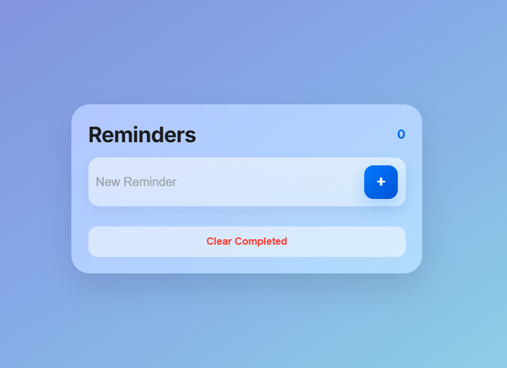

# to-do app

A simple and elegant to-do list web app made with pure **HTML**, **CSS**, and **JavaScript**.  
Built to show off clean design, responsive layout, and smooth usability — no frameworks, no dependencies.

---

## Features

- ➕ Add new tasks easily  
- ✅ Mark tasks as completed  
- 🗑️ Delete individual tasks  
- 🧹 Clear all completed tasks at once  
- 💾 Tasks are saved automatically using localStorage  
- 📱 Works on both desktop and mobile browsers  
- 🎨 Sleek, Apple-style UI with soft animations  

---

## 🖼️ Preview

## Design Notes

Glassmorphism style using backdrop-filter and subtle blur
Buttons and tasks have hover + active animations
Responsive grid for phones and desktops
Smooth fade-in/out transitions when adding or removing tasks

## Tech Stack

HTML5
CSS3 (Flexbox, transitions, custom variables)
Vanilla JavaScript (ES6+)
Browser localStorage API
